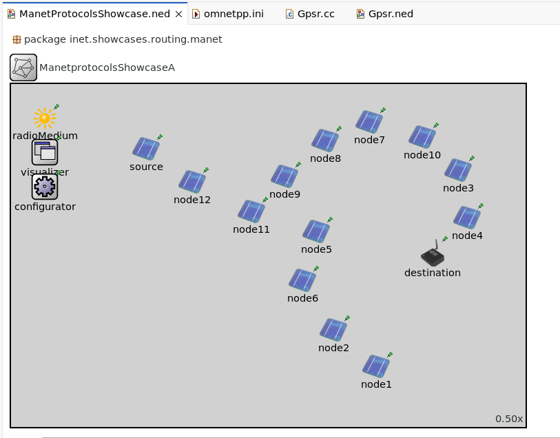
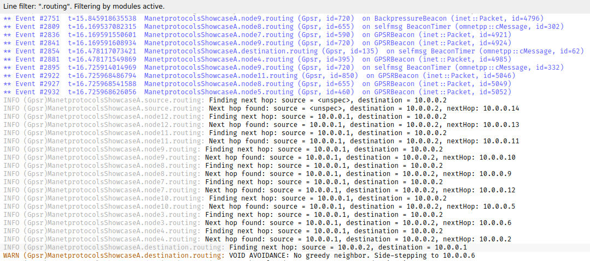

# Protocolo GPSR con Evasión de Vacíos (Void Avoidance) mediante Backpressure


Este repositorio contiene la implementación de una variante optimizada del protocolo de enrutamiento geográfico **GPSR (Greedy Perimeter Stateless Routing)**. El proyecto aborda la problemática de los **mínimos locales (vacíos)** en Redes de Sensores Inalámbricos (WSN) y MANETs, sustituyendo el costoso "Modo Perímetro" estándar por una estrategia reactiva y eficiente basada en **Backpressure** y **Relaxed Greedy Forwarding**.

---

## 🚀 Características Principales

Esta implementación mejora el módulo `gpsr.cc` del framework INET introduciendo las siguientes capacidades:

* **Detección Proactiva de Vacíos:** Los nodos identifican cuándo no tienen vecinos más cercanos al destino (Local Minima).
* **Mecanismo de Backpressure:** Envío de paquetes de control (`BackpressureBeacon`) hacia el salto anterior para notificar rutas inviables y bloquearlas temporalmente.
* **Recuperación Lateral (Fallback):** Implementación de una lógica "Relaxed Greedy" que permite seleccionar al siguiente mejor vecino (incluso si se aleja ligeramente del destino) cuando la ruta óptima está bloqueada, logrando rodear obstáculos geométricos.
* **Tolerancia a Fallos:** Capacidad de auto-reparación ante la muerte súbita de nodos o desconexiones, mediante temporizadores de vecindad y re-cálculo dinámico de rutas.
* **Eficiencia Computacional:** Elimina la necesidad de calcular grafos planares (RNG/GG) y la regla de la mano derecha, reduciendo el overhead de CPU en los nodos sensores.

---

## 🛠️ Tecnologías y Requisitos

* **Simulador:** OMNeT++ (v6.0 o superior recomendado)
* **Framework:** INET (v4.5 o compatible)
* **Lenguaje:** C++ / NED

---

## ⚙️ Instalación y Configuración

1.  **Clonar el repositorio:**
    ```bash
    git clone [https://github.com/tu-usuario/omnetpp-gpsr-void-avoidance.git](https://github.com/tu-usuario/omnetpp-gpsr-void-avoidance.git)
    ```

2.  **Integración con INET:**
    * Copia los archivos modificados (`Gpsr.cc`, `Gpsr.h`, `Gpsr.ned`) dentro de la carpeta de tu instalación de INET, usualmente en: `inet/src/inet/routing/gpsr/`.
    * *Nota:* Se recomienda hacer una copia de seguridad de los archivos originales de INET.

3.  **Recompilar INET:**
    Desde el IDE de OMNeT++ o terminal:
    ```bash
    make MODE=release all
    ```

4.  **Configuración del `omnetpp.ini`:**
    Para activar la nueva lógica, asegúrate de añadir el parámetro `useBackpressure` en tu archivo de configuración:

    ```ini
    [Config ManetShowcase]
    network = ManetprotocolsShowcaseA
    # ... otras configuraciones ...
    **.routingProtocol = "Gpsr"
    **.routing.useBackpressure = true  <-- ¡IMPORTANTE!
    **.routing.beaconInterval = 1s
    ```

---

## 🧠 Funcionamiento del Algoritmo

El protocolo opera bajo una máquina de estados simplificada para la toma de decisiones de siguiente salto:

1.  **Intento Greedy Estricto:** Busca el vecino que más reduzca la distancia al destino.
2.  **Verificación de Bloqueo:** Si el mejor candidato está en la lista negra (por un aviso previo de `Backpressure`), se ignora.
3.  **Intento Fallback (Side-stepping):** Si no hay candidato Greedy, busca cualquier vecino disponible que no sea el nodo anterior (para evitar bucles). Esto permite "moverse de lado" para rodear un obstáculo.
4.  **Acción de Backpressure:** Si no hay ningún vecino viable (ni Greedy ni Fallback):
    * Se envía un mensaje `BackpressureBeacon` al nodo que envió el paquete.
    * El paquete actual se descarta para evitar congestión.
    * El nodo anterior recibe el aviso y marca esa ruta como "Dead End".

---

## 📊 Escenario de Prueba y Resultados

Se diseñó una topología con una "trampa" o vacío cóncavo para forzar el fallo del algoritmo Greedy tradicional.

### Topología

*Los nodos 5 y 6 representan un callejón sin salida. La ruta viable requiere un desvío por la parte superior (Nodos 8, 7, 10).*

### Resultado: Ruta Establecida
Tras una fase inicial de aprendizaje donde se detectan los bloqueos, la red converge y establece una ruta exitosa bordeando el vacío:


**Evidencia de funcionamiento:**
* Detección de `VOID` en nodo 5.
* Activación de `Backpressure` hacia nodos anteriores.
* Establecimiento de ruta alternativa: `Source -> N12 -> N11 -> N9 -> N8 -> N7 -> N10 -> N3 -> N4 -> Destino`.

---

## 📂 Estructura del Proyecto

```text
├── src/
│   ├── Gpsr.cc           # Lógica principal (Greedy + Backpressure)
│   ├── Gpsr.h            # Definición de estructuras y beacons
│   └── Gpsr.ned          # Definición del módulo y parámetros
├── simulations/
│   ├── omnetpp.ini       # Configuración de los escenarios de prueba
│   └── Network.ned       # Topología de la red
├── images/               # Capturas de resultados
└── README.md             # Documentación
